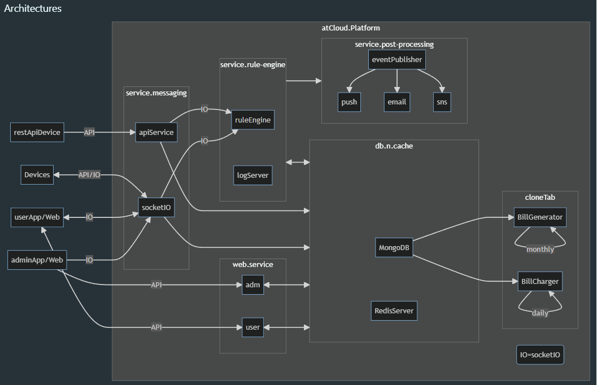
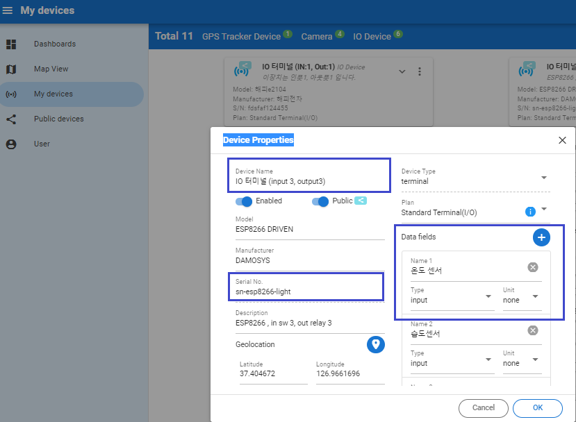

# atCloud
By generalizing IoT devices, all devices are managed as a single unit object. All devices are managed with the same method, and the view widget is different according to the user's viewing method.

## Live Demo : https://damosys.com:9000
---
## Basic network

## IoT Devices
Devices are defined in three types as follows.
### "IO Device"
 With the following combination, one autonomous city can have 10 pieces of information.
- Input device
  Data Gathering Devices
    ```
    Input signal( 0 or 1)
    Generic Sensor input
    ```

- Output device
  Controlling Devices
    ```
    Output ( 0 or 1) like Relay
    Generic commands(user defined command)
    ```
### GPS Tracker
- GPS data uploading device
### CCTV 
- CCTV Streaming Device


## Device Data Syntax
The device uploads data in a standardized format. The following syntax applies. Device isdesigned upload "DATA" and "STATUS OF DEVICE" <br>
### Data Syntax
- [number1,...,number-10], number can be "integer" and "float" type
- It can be one data like [number] and also can be be two like [number,number], max 10 number can be applied 
- [Arnuino Sample Cde Here](https://github.com/manulsan/atCloud/blob/main/sdks/arduino/esp8266/InputOutput/InputOutput.ino)
- ex>
 ```js
    void publishData(uint32_t now)
    {
        char szBuf[128];
        sprintf(szBuf, "[%d,%d,%d,%d,%d,%d]",
                _portMap[0].state, _portMap[1].state, _portMap[2].state,
                _portMap[3].state, _portMap[4].state, _portMap[5].state);        
        publish("dev-data", szBuf);    
 ```

  
### STATUS Syntax
- Any string 
- ex>
```
    publish("dev-data", "System is Ready");    
```

## Device Data And App View expression
- Device has "Serial Number" only.
- The data is defined at the platform by the user.( if not, default property is applied)
- <bold> "Data Field"</bold> is one of device data expression and uer can define it name or properties
- All information can be made with QR code ( commercial device only )

