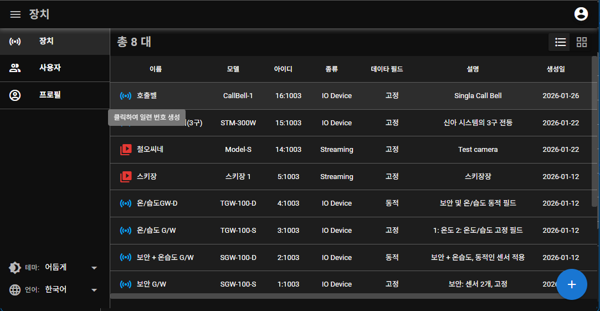
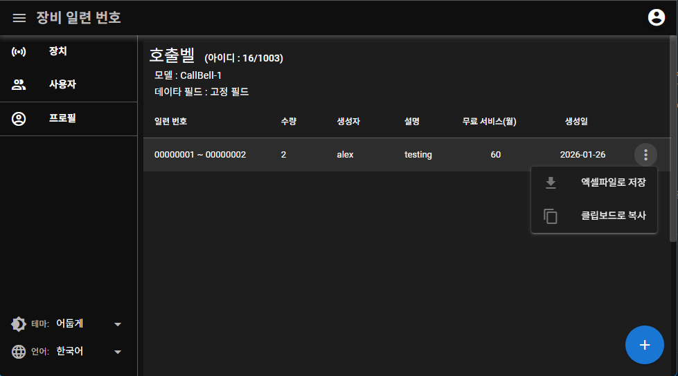
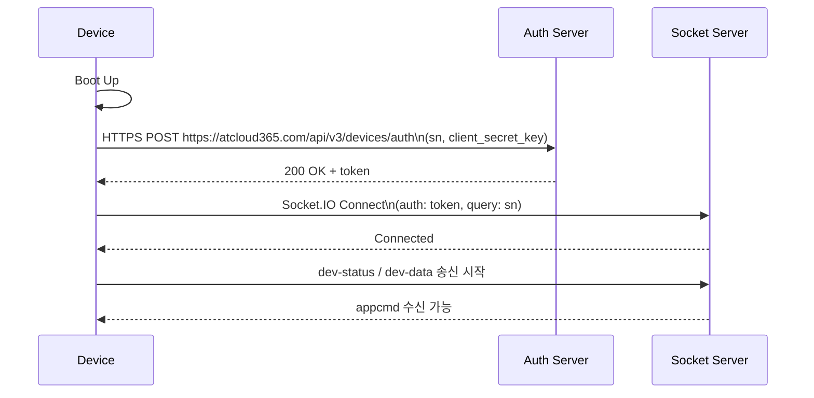
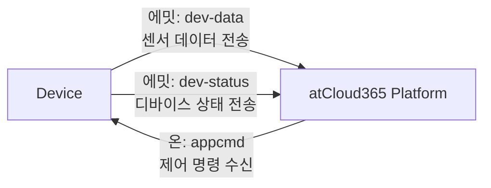

# atCloud365 SDK Examples

[](https://opensource.org/licenses/MIT)

**atCloud365 IoT 플랫폼과 통신하는 디바이스 SDK 참조 예제 모음**

이 저장소는 **[atCloud365 IoT 플랫폼](https://atcloud365.com)** 통신하는 다양한 프로그래밍 언어 및 플랫폼의 **실제 동작 가능한 예제 프로젝트**를 제공합니다. 각 프로젝트는 독립적으로 실행 가능하며, IoT 디바이스 개발 시 참조 코드로 활용할 수 있습니다.

특히 이 SDK는 **제조 업체 개발자**가 atCloud365 플랫폼과 연동되는 IoT 디바이스를 개발할 때,
연동 방식을 빠르게 이해하고 적용할 수 있도록 언어별 샘플을 제공합니다.

즉, 제조사 개발팀이 "디바이스 정의 → Serial No(DEVICE_SN) 발급/관리 → 펌웨어 적용 → 출하 제품 등록"까지
실무에 바로 적용할 수 있도록 구성된 참조 SDK 모음입니다.

---

## 📋 목차

- [특징](#-특징)
- [MFG 연동 개요](#-mfg-연동-개요)
- [개발·출하 연동 흐름](#-개발출하-연동-흐름)
- [프로젝트 구조](#-프로젝트-구조)
- [시작하기](#-시작하기)
- [통신 프로토콜](#-통신-프로토콜)
- [인증 방식](#-인증-방식)
- [설정 방법](#-설정-방법)
- [지원 플랫폼](#-지원-플랫폼)
- [기여하기](#-기여하기)
- [라이센스](#-라이센스)

---

## ✨ 특징

- **실시간 통신**: Socket.IO 기반 양방향 실시간 데이터 통신
- **다중 플랫폼**: ESP32(PlatformIO/Arduino IDE), Python, Node.js 지원
- **완전한 예제**: 각 프로젝트는 즉시 실행 가능한 완전한 코드 제공
- **보안**: HTTPS + Token 기반 인증 시스템
- **타입별 구분**: Input Device(입력 디바이스, 센서) / Output Device(출력 디바이스, 액추에이터) 예제 분리
- **오픈소스**: MIT 라이센스로 자유롭게 사용 및 수정 가능

---

## 🏭 제조 업체에서 사용 방법

업체는 [atCloud365.com/mfg](https://atcloud365.com/mfg)에서 개발 디바이스 속성 정의, 디바이스별 **Serial No (DEVICE_SN)** 및 **SECRET_KEY**를 생성/관리합니다.

### 🔄 개발·출하 연동 흐름

| 단계 | 주체 | 작업 내용 | 적용/결과 |
|:--:|:---:|:---|---|
| 1 | 개발업체 | MFG 가입/로그인 및 디바이스 속성 정의 | `atcloud365.com/mfg`에 디바이스 모델 등록 |
| 2 | 개발업체 | 디바이스별 `Serial No (DEVICE_SN)` 및 `SECRET_KEY` 생성 | 디바이스 식별/인증 정보 확정 |
| 3 | 펌웨어 개발자 | `DEVICE_SN`, `SECRET_KEY`로 디바이스 인증/통신 구현 | `DEVICE_SN`을 BLE 통신 ID에 적용 |
| 4 | 제품 출하 | 동일 `DEVICE_SN` 기반으로 출하 라벨 구성 | QR code/패키지(BOX, PCB 등)에 반영 |
| 5 | 구매자 | 플랫폼에서 제품 등록 | 앱/웹에서 QR 또는 BLE로 장치 등록 후 사용 |

### 🔄 화면 예시




> 💡 **중요**: 각 하위 폴더는 독립적인 프로젝트이며, 개별 README.md를 포함합니다.

---

## 🚀 시작하기

### 0. 프로젝트 구조

```
sdks/
├── device-sdk/                  # 디바이스용 SDK 예제
│   ├── c/                      # C/C++ 언어
│   │   ├── platformio/         # PlatformIO 기반 (ESP32)
│   │   │   ├── input-device/   # 센서 데이터 전송 예제
│   │   │   └── output-device/  # 제어 명령 수신 예제
│   │   └── arduino-idf/        # Arduino IDE 기반 (ESP32)
│   │       ├── input-device/   # 센서 데이터 전송 예제
│   │       └── output-device/  # 제어 명령 수신 예제
│   ├── python/                 # Python 예제
│   └── nodejs/                 # Node.js 예제
├── app-sdk/                    # 애플리케이션용 SDK (향후)
├── LICENSE                     # MIT 라이센스
└── README.md                   # 이 문서
```

### 1. 저장소 클론

```bash
git clone https://github.com/your-org/atcloud365-sdks.git
cd atcloud365-sdks
```


### 2. 프로젝트 선택

사용하려는 플랫폼에 맞는 프로젝트 폴더로 이동:

```bash
# PlatformIO 예제
cd device-sdk/c/platformio/input-device

# Python 예제
cd device-sdk/python/input-device

# Node.js 예제
cd device-sdk/nodejs/input-device
```

### 3. 설정 파일 생성

각 프로젝트의 `config.example.*` 파일을 복사하여 실제 설정 파일 생성:

```bash
# C/C++ 프로젝트
cp config.example.h config.h

# Python 프로젝트
cp config.example.py config.py

# Node.js 프로젝트
cp .env.example .env
```

### 4. 인증 정보 입력

생성한 설정 파일에 atCloud365에서 발급받은 인증 정보를 입력:

```cpp
// config.h (C/C++)
#define DEVICE_SN "YOUR_DEVICE_SN_HERE"
#define CLIENT_SECRET_KEY "YOUR_SECRET_KEY_HERE"
#define SERVER_URL "https://atcloud365.com"
#define API_PATH "/api/dev/io/"
```

```python
# config.py (Python)
DEVICE_SN = "YOUR_DEVICE_SN_HERE"
CLIENT_SECRET_KEY = "YOUR_SECRET_KEY_HERE"
DEVICE_AUTH_URI = "https://atcloud365.com/api/v3/devices/auth"
```

```env
# .env (Node.js)
DEVICE_SN=YOUR_DEVICE_SN_HERE
CLIENT_SECRET_KEY=YOUR_SECRET_KEY_HERE
DEVICE_AUTH_URI=https://atcloud365.com/api/v3/devices/auth
```

### 5. 빌드 및 실행

각 프로젝트의 README.md를 참조하여 빌드 및 실행:

- **PlatformIO**: `pio run -t upload`
- **Arduino IDE**: IDE에서 열어 업로드
- **Python**: `python main.py`
- **Node.js**: `npm install && npm start`

---

## 🔌 통신 프로토콜

### 인증 플로우


```mermaid
sequenceDiagram
    participant D as Device
    participant A as Auth Server
    participant S as Socket Server

    D->>D: Boot Up
    D->>A: HTTPS POST https://atcloud365.com/api/v3/devices/auth\n(sn, client_secret_key)
    A-->>D: 200 OK + token
    D->>S: Socket.IO Connect\n(auth: token, query: sn)
    S-->>D: Connected
    D->>S: dev-status / dev-data 송신 시작
    S-->>D: appcmd 수신 가능
```

### Socket.IO 이벤트


```mermaid
flowchart LR
    D["Device"] -->|"에밋: dev-data\n센서 데이터 전송"| P["atCloud365 Platform"]
    D -->|"에밋: dev-status\n디바이스 상태 전송"| P
    P -->|"온: appcmd\n제어 명령 수신"| D
```

#### 이벤트 요약

- 디바이스 → 플랫폼
  - `dev-data`: 센서 데이터 전송 (`{ content: [-4, 2] }`)
  - `dev-status`: 디바이스 상태 전송 (`{ status: "online" }`)
- 플랫폼 → 디바이스
  - `appcmd`: 제어 명령 수신 (`{ command: "turn_on" }`)

---

## 🔐 인증 방식

### 필수 정보 (공통)

모든 디바이스는 다음 정보를 공통으로 사용합니다:

1. **DEVICE_SN**: 디바이스 고유 Serial No (예: `03EB023C002601000000FF`)
2. **CLIENT_SECRET_KEY**: bcrypt 해시된 비밀 키 (예: `$2b$10$MTQ9AXj...`) / 장치별 보안 키 관리
3. **SERVER_URL**: 플랫폼 엔드포인트 (기본값: `https://atcloud365.com`)

### 필수 정보 (언어별)

- **C/C++ (PlatformIO/Arduino)**
  - **API_PATH**: Socket.IO path (기본값: `/api/dev/io/`)
  - **HTTP_TIMEOUT / SOCKETIO_TIMEOUT**: 통신 타임아웃(ms)
- **Python / Node.js**
  - **DEVICE_AUTH_URI**: 디바이스 인증 URI (기본값: `https://atcloud365.com/api/v3/devices/auth`)

### 보안 주의사항

⚠️ **중요**: 
- 실제 인증 정보는 절대 Git에 커밋하지 마세요
- `config.h`, `config.py`, `.env` 파일은 `.gitignore`에 등록되어 있습니다
- 프로덕션 환경에서는 환경 변수 사용을 권장합니다

---

## 🛠️ 설정 방법

### 공통 설정 값 (모든 언어)

```
DEVICE_SN          : 디바이스 Serial No (atCloud365에서 발급)
CLIENT_SECRET_KEY  : 인증 비밀 키 (atCloud365에서 발급)
SERVER_URL         : https://atcloud365.com
```

### 언어별 추가 설정 값

```
C/C++ (PlatformIO/Arduino)
API_PATH           : /api/dev/io/
HTTP_TIMEOUT       : 30000 (ms)
SOCKETIO_TIMEOUT   : 60000 (ms)

Python / Node.js
DEVICE_AUTH_URI    : https://atcloud365.com/api/v3/devices/auth
DATA_UPLOAD_INTERVAL : 예) 5~10 (s)
STATUS_REPORT_INTERVAL: 예) 60 (s)
```

### 설정 파일 위치

각 프로젝트는 자체 설정 파일을 포함합니다:

- **C/C++**: `config.h` (템플릿: `config.example.h`)
- **Python**: `config.py` (템플릿: `config.example.py`)
- **Node.js**: `.env` (템플릿: `.env.example`)

---

## 💻 지원 플랫폼

### Hardware

- **ESP32** (주요 타겟)
- Raspberry Pi (Python)
- PC/서버 (Python, Node.js)

### Development Environments

- **PlatformIO**: ESP32 개발용 크로스 플랫폼 IDE
- **Arduino IDE**: ESP32 Arduino 프레임워크
- **Python 3.7+**: 고급 언어 지원
- **Node.js 14+**: JavaScript/TypeScript 지원

### Network

- **WiFi** (ESP32 내장 WiFi 사용)
- **HTTPS/TLS** 보안 통신
- **WebSocket** (Socket.IO) 실시간 통신

---

## 📚 예제 프로젝트

### Input Device (입력 디바이스, 센서)

센서 데이터를 수집하여 atCloud365 플랫폼으로 전송하는 예제:

- 온도, 습도, 조도 등의 센서 값 읽기
- Socket.IO `dev-data` 이벤트로 데이터 전송
- 변경 감지 또는 주기적 전송 (1분)

**예제 위치**:
- `device-sdk/c/platformio/input-device/`
- `device-sdk/c/arduino-idf/input-device/`

### Output Device (출력 디바이스, 액추에이터)

atCloud365 플랫폼에서 제어 명령을 수신하여 실행하는 예제:

- Socket.IO `appcmd` 이벤트 수신
- 릴레이, LED, 모터 등 제어
- 제어 결과 피드백

**예제 위치**:
- `device-sdk/c/platformio/output-device/`
- `device-sdk/c/arduino-idf/output-device/`

---

## 🔧 문제 해결

### WiFi 연결 실패

```
문제: WiFi에 연결되지 않음
해결: config 파일의 WiFi SSID와 비밀번호 확인
```

### 인증 실패

```
문제: HTTPS 인증 실패 (401 Unauthorized)
해결: DEVICE_SN(Serial No) 및 CLIENT_SECRET_KEY 확인
```

### Socket.IO 연결 끊김

```
문제: Socket.IO 연결이 자주 끊어짐
해결: 
  1. WiFi 신호 강도 확인
  2. 재연결 로직 활성화 확인
  3. 타임아웃 값 증가
```

### 메모리 부족 (ESP32)

```
문제: ESP32 메모리 부족 에러
해결:
  1. 불필요한 라이브러리 제거
  2. 버퍼 크기 감소
  3. 동적 메모리 사용 최소화
```

자세한 문제 해결 방법은 각 프로젝트의 README.md를 참조하세요.

---

## 🤝 기여하기

이 프로젝트는 오픈소스이며 커뮤니티의 기여를 환영합니다!

### 기여 방법

1. 이 저장소를 Fork
2. 새 브랜치 생성 (`git checkout -b feature/YourFeature`)
3. 변경사항 커밋 (`git commit -m 'Add some feature'`)
4. 브랜치에 푸시 (`git push origin feature/YourFeature`)
5. Pull Request 생성

### 코딩 스타일

- 각 언어의 표준 스타일 가이드 준수
- 명확한 주석 및 문서화
- 예제 코드는 간결하고 이해하기 쉽게 작성

---

## 📖 추가 문서

- [work-log.md](work-log.md) - 프로젝트 상세 설계 문서
- 각 프로젝트 폴더의 README.md - 개별 프로젝트 가이드

---

## 📞 지원

- **이슈 보고**: [GitHub Issues](https://github.com/your-org/atcloud365-sdks/issues)
- **공식 웹사이트**: [atCloud365.com](https://atcloud365.com)
- **문의**: support@atcloud365.com

---

## 📄 라이센스

이 프로젝트는 [MIT 라이센스](LICENSE)를 따릅니다.

```
Copyright (c) 2026 atCloud365

자유롭게 사용, 수정, 배포 가능합니다.
```

---

## 🌟 Quick Start 예시

### PlatformIO (ESP32 Input Device, 입력 디바이스)

```bash
cd device-sdk/c/platformio/input-device
cp config.example.h config.h
# config.h에 DEVICE_SN, CLIENT_SECRET_KEY, SERVER_URL, API_PATH 입력
pio run -t upload
pio device monitor
```

### Python

```bash
cd device-sdk/python/input-device
cp config.example.py config.py
# config.py에 DEVICE_SN, CLIENT_SECRET_KEY, DEVICE_AUTH_URI 입력
pip install -r requirements.txt
python main.py
```

### Node.js

```bash
cd device-sdk/nodejs/input-device
cp .env.example .env
# .env에 DEVICE_SN, CLIENT_SECRET_KEY, DEVICE_AUTH_URI 입력
npm install
npm start
```

---

**Happy Coding! 🚀**

IoT 개발에 행운을 빕니다!
